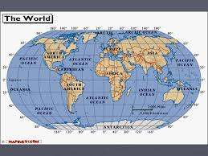

# What's the Weather Like? Find it by using Python API

## WeatherPy

A Python script is created to visualize the weather of 500+ cities across the world of varying distance from the equator.
To accomplish this, the [OpenWeatherMap API](https://openweathermap.org/api),is used to create a representative model of weather across world cities.

Various scatter plots are created to showcase the following relationships:

* Temperature (F) vs. Latitude
* Humidity (%) vs. Latitude
* Cloudiness (%) vs. Latitude
* Wind Speed (mph) vs. Latitude

## Findings:

**Latitude vs. Temperature Plot**
- Scatter Plot shows the gradual increase in temperature as the distance from Equator (0 Latitude) decreases.
- Regions closer to Earth’s equator experience higher temperatures than 
regions near the North and South poles.
-	Highest temperatures occur between 0 and +-40 Latitude.

**Latitude vs. Humidity Plot**
- Scatter Plot shows that humidity at this time of year does not really vary with Latitude. The plot shows a Humidity percent between 60 to 100% for all Latitude. Latitude 40-70 (Northern Hemisphere) seems to have higher 
percentage of Humidity

**Latitude vs. Cloudiness Plot**
-	Scatter Plot does not really show any pattern for Cloudiness. Cities on same Latitude have Cloudiness% varying from 0 to 100% indicating that there are other factors in play

**Latitude vs. Wind Speed Plot**
-	Scatter Plot shows Wind speed up to 10mph for all Latitude. Wind speed is increasing towards higher Latitude especially in Northern Hemisphere with speeds reaching up to 20 mph for some cities.

---
### Libraries/Tool used :
- Pandas ,Matplotlib ,Numpy
- requests,time,os,csv
- api_keys
- citypy
